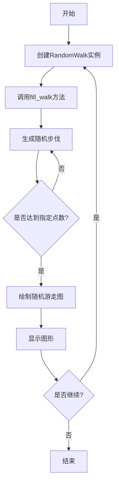
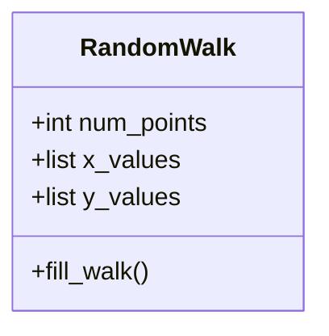

# 实验三 数据可视化

班级： 22物联2

学号： B20220305211

姓名： 李德喜

Github地址：<https://github.com/YosparNa/data-visualization.git>

---

## 实验目的

1. 利用Matplotlib库进行数据可视化
2. 利用Plotly库进行数据可视化
3. 使用Git进行版本控制和团队协作
4. 能简单地使用Numpy和Pandas处理数据

## 实验环境

1. Git
2. Python
3. VSCode
4. VSCode插件
   - Python
   - Markdown PDF
   - Markdown Preview Mermaid Support
   - GitLens

## 实验项目分工协作情况

### 项目组员

谭伟阳，彭哲，李德喜，肖昊

### 项目分工

- 谭伟阳：负责绘制简单的折线图，使用 Plotly 可视化仓库
- 彭哲，肖昊：负责使用 Plotly 模拟掷骰子，从网上下载数据，并对其进行可视化
- 李德喜：负责使用 Python 生成随机游走数据，再使用 Matplotlib 以美观的形式将这些数据呈现出来，使用api对来自 GitHub 的信息进行可视化
  
## 实验过程记录

### 实验代码

1. 创建 RandomWalk 类来生成随机游走数据

```python
from random import choice

class RandomWalk:
    """一个生成随机游走数据的类"""
    def __init__(self, num_points=5000):
        """初始化随机游走的属性"""
        self.num_points = num_points
        # 所有随机游走都始于(0, 0)
        self.x_values = [0]
        self.y_values = [0]
    def fill_walk(self):
        """计算随机游走包含的所有点"""
        # 不断游走，直到列表达到指定的长度
        while len(self.x_values) < self.num_points:
            # 决定前进的方向以及沿这个方向前进的距离
            x_direction = choice([1, -1])
            x_distance = choice([0, 1, 2, 3, 4])
            x_step = x_direction * x_distance
            y_direction = choice([1, -1])
            y_distance = choice([0, 1, 2, 3, 4])
            y_step = y_direction * y_distance
            # 拒绝原地踏步
            if x_step == 0 and y_step == 0:
                continue
          # 计算下一个点的 x 坐标值和 y 坐标值
            x = self.x_values[-1] + x_step
            y = self.y_values[-1] + y_step
            self.x_values.append(x)
            self.y_values.append(y)
```

1. 编写rw_visual类来绘制随机游走图

```python
import matplotlib.pyplot as plt

from random_walk import RandomWalk
# 只要程序处于活动状态，就不断地模拟随机游走

while True:
    # 创建一个 RandomWalk 实例
    rw = RandomWalk(50_000)
    rw.fill_walk()
    # 将所有的点都绘制出来
    plt.style.use('classic')
    fig, ax = plt.subplots(figsize=(10, 6), dpi=128)
    point_numbers = range(rw.num_points)
    ax.scatter(rw.x_values, rw.y_values, c=point_numbers, cmap=plt.cm.Blues,
        edgecolors='none', s=1)
    ax.set_aspect('equal')
    # 突出起点和终点
    ax.scatter(0, 0, c='green', edgecolors='none', s=100)
    ax.scatter(rw.x_values[-1], rw.y_values[-1], c='red', edgecolors='none',
        s=100)
    # 隐藏坐标轴
    ax.get_xaxis().set_visible(False)
    ax.get_yaxis().set_visible(False)
    plt.show()
    keep_running = input("Make another walk? (y/n): ")
    if keep_running == 'n':
        break
```

### 程序流程图



### 类图



## 实验总结

在本次实验中，我学习并应用了多种编程工具和技术，具体包括：

1. **编程工具的使用**：
   - 熟悉了Python编程语言，特别是如何使用Matplotlib和Plotly库进行数据可视化。
   - 学会了使用VSCode作为开发环境，并利用其插件提高编程效率。

2. **数据结构**：
   - 理解了列表（list）在存储和处理数据中的重要性，特别是在生成随机游走数据时，如何动态地添加和管理坐标点。

3. **程序语言的语法**：
   - 深入理解了Python的类和对象的概念，通过创建`RandomWalk`类来封装随机游走的逻辑。
   - 学习了如何使用条件语句和循环结构来控制程序的流程。

4. **算法**：
   - 掌握了随机游走算法的基本原理，理解了如何通过随机选择方向和步长来模拟随机运动。

5. **编程技巧**：
   - 学会了如何使用Matplotlib库绘制散点图，并通过设置样式和颜色来增强图形的可读性和美观性。
   - 通过输入控制程序的循环，使得用户可以选择是否继续生成新的随机游走图。

6. **编程思想**：
   - 理解了模块化编程的重要性，通过将功能分解为不同的类和方法，使得代码更加清晰和易于维护。
   - 认识到数据可视化在数据分析中的重要性，能够通过图形化的方式更直观地展示数据的变化和趋势。

通过本次实验，我不仅提高了编程能力，还加深了对数据可视化和算法的理解，为今后的学习和研究打下了坚实的基础。
